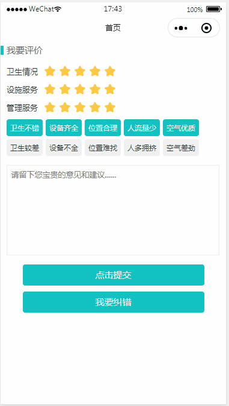

# taro-evaluate-demo
> 本demo是基于本人在taro小程序开发中，抽取出来的评价模块，因为算是自己开发的第一个ui组件(评分)，因此来记录下。

## 运行
> 详情参考官网：https://nervjs.github.io/taro/docs/GETTING-STARTED.html
- 安装 node.js
- 安装 tarojs/cli
- clone该项目
- npm install
- 微信小程序运行
    - npm run dev:weapp
    - 使用微信开发者工具打开该项目
    
## 预览

    
